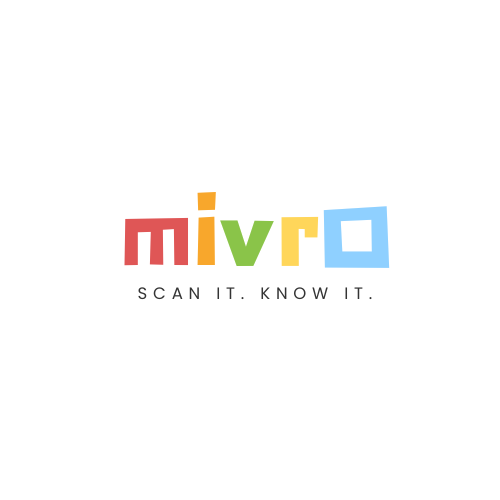
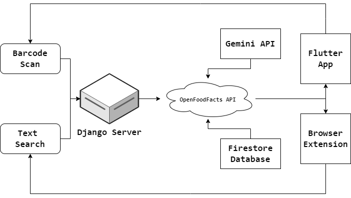

<p align="center">
  
</p>

## Project Description

The app supports barcode scanning for foods, drinks, cosmetics, medicines, and pet foods. It provides detailed ingredient information, categorizes nutrients into positive and negative (either generally or based on user-specific health data), identifies associated health risks, and suggests alternatives using an AI recommendation engine.

### Key Features

- **Search Engine:** Easily find products without barcode scanning, with upcoming support for image and live product recognition.
- **Meal Tracker:** Monitor your daily nutritional intake by scanning product barcodes, allowing you to easily track and manage your meals.
- **Marketplace:** Discover and purchase alternative partnered healthy products.
- **Browser Extension:** Integrate app features seamlessly into your online shopping experience.

Additionally, the app includes a Recipe Chatbot for personalized recipe recommendations and a Scan History feature to track previously scanned products.

## System Architecture

<p align="center">
  
</p>

---

1. **Barcode Scan**: Utilizes the `zxing_flutter` library to capture barcode input from the user via the Flutter app. The scanned barcode is then sent to the Django server for further processing.

2. **Text Search**: Accepts text input from the user through the Flutter app for product lookup. This input is forwarded to the Django server to query the Firestore database for relevant product information.

3. **Django Server**: Serves as the central backend server responsible for data cleaning, user authentication, integration with the Gemini API, and interaction with Google Firebase services.

4. **OpenFoodFacts API**: Fetches raw, detailed information about products based on barcode or text search inputs. This API provides comprehensive ingredient and nutritional data, including metadata such as name, brand, and more.

5. **Gemini API**: Processes the raw data obtained from the OpenFoodFacts API, categorizing nutrients into positive and negative groups and identifying any health risks associated with the product.

6. **Firestore Database**: Stores processed product information, facilitating quick lookups for both the browser extension and the Flutter app. If no barcode is detected, it searches the database for relevant details.

7. **Flutter App**: Cross-platform mobile application enabling users to scan barcodes for offline shopping, access features such as a recipe chatbot, scan history, and a marketplace for healthy products.

8. **Browser Extension**: Extends the features of the Flutter app to the user's online shopping experience, allowing barcode scanning, product lookups, and health risk assessments directly within the browser.

## Getting Started

Follow these steps to set up and run the Mivro software on your local machine, or you can watch the [demo video](https://youtube.com/watch?v=sWd4kOQU9as).

### Prerequisites

- [Python >= 3.11.9](https://www.python.org/ftp/python/3.11.9/python-3.11.9-amd64.exe)
- [Node.js >= 20.14.0](https://nodejs.org/dist/v20.14.0/node-v20.14.0-x64.msi)

### Installation

1. Clone the repository to your local machine:
    ```shell
    git clone https://github.com/SpaceTesla/Mivro.git
    ```

2. Navigate to the project directory:
    ```shell
    cd Mivro
    ```

3. Create a virtual environment (optional but recommended):
    ```shell
    python -m venv .venv
    ```

4. Activate the virtual environment:
    - Windows:
        ```shell
        .venv\Scripts\activate
        ```
    - macOS and Linux:
        ```shell
        source .venv/bin/activate
        ```

5. Install the project dependencies:
    ```shell
    pip install -r requirements.txt
    ```

6. Set up the Chrome extension:
    - Open Chrome and go to `chrome://extensions`.
    - Enable "Developer mode" (top right corner).
    - Click "Load unpacked" (top left corner).
    - Select the `browser-extension` folder in the Mivro repository.

7. Contact [@areeb](https://instagram.com/areebahmeddd) to get the `.env` file containing necessary configuration details.

### Usage

1. Launch the application by clicking the run button in the top right of VS Code, or execute:
    ```shell
    python python-app/app.py
    ```

2. Using the Browser Extension:
    - Navigate to any of the following supported websites:
      - https://www.bigbasket.com
      - https://www.swiggy.com
      - https://www.zeptonow.com
      - https://www.jiomart.com
      - https://www.amazon.com
      - https://www.flipkart.com

    - Select and open any product. The browser extension will appear on the right side of the screen. Click on the extension icon to access detailed information.

3. For Contributors:
    - To apply changes made to the browser extension, visit `chrome://extensions`, click the "Update" button at the top left, and reload the product page to see the updates.

## License

This project is licensed under the [MIT License](https://github.com/SpaceTesla/Mivro/blob/main/LICENSE).

## Authors

[Areeb Ahmed](https://github.com/areebahmeddd) - [Shivansh Karan](https://github.com/SpaceTesla) - [Rishi Chirchi](https://github.com/rishichirchi)
